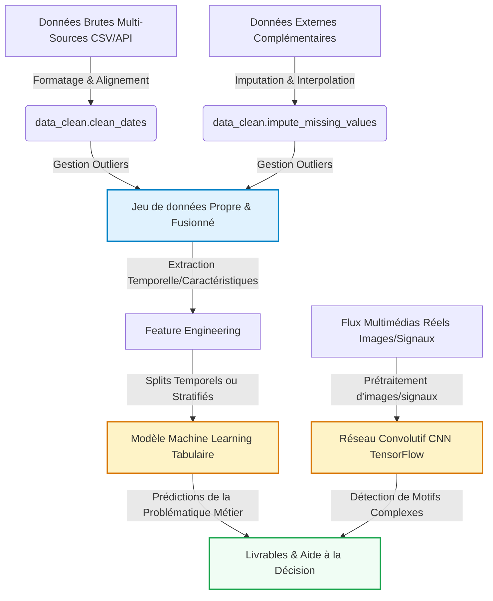

# Mon Projet Data Science
Étudiant(e) 1 : \[Insérer Prénom Nom\], Étudiant(e) 2 : \[Insérer Prénom
Nom\], Étudiant(e) 3 : \[Insérer Prénom Nom\]
2026-05-18

- [Introduction et Contexte Métier](#sec-intro)
  - [Contexte du Projet](#contexte-du-projet)
  - [Objectif Analytique](#objectif-analytique)
- [Acquisition et Préparation des Données (Data
  Wrangling)](#sec-wrangling)
  - [Audit de Qualité](#audit-de-qualité)
  - [Algorithme de Nettoyage](#algorithme-de-nettoyage)
  - [Travaux Pratiques de Wrangling](#travaux-pratiques-de-wrangling)
- [01 — Acquisition, compréhension et préparation des
  données](#01--acquisition-compréhension-et-préparation-des-données)
  - [Objectif du notebook](#objectif-du-notebook)
  - [Structure du dataset](#structure-du-dataset)
  - [Chargement des activités](#chargement-des-activités)
  - [Chargement des variables](#chargement-des-variables)
  - [Reconstruction des jeux train et
    test](#reconstruction-des-jeux-train-et-test)
  - [Vérifications qualité](#vérifications-qualité)
  - [Sauvegarde des données tabulaires
    propres](#sauvegarde-des-données-tabulaires-propres)
  - [Préparation des signaux
    inertiels](#préparation-des-signaux-inertiels)
  - [Conclusion du wrangling](#conclusion-du-wrangling)
- [Analyse Exploratoire des Données (EDA)](#sec-eda)
  - [Statistiques Descriptives](#statistiques-descriptives)
  - [Ingénierie de Variables (Feature
    Engineering)](#ingénierie-de-variables-feature-engineering)
  - [Travaux Pratiques d’Exploration Visuelle
    (EDA)](#travaux-pratiques-dexploration-visuelle-eda)
- [02 — Analyse exploratoire et
  visualisation](#02--analyse-exploratoire-et-visualisation)
  - [Vue générale du dataset](#vue-générale-du-dataset)
  - [Qualité des données](#qualité-des-données)
  - [Répartition des activités](#répartition-des-activités)
  - [Répartition train/test](#répartition-traintest)
  - [Activités par split](#activités-par-split)
  - [Activités dynamiques et
    statiques](#activités-dynamiques-et-statiques)
  - [Répartition des sujets](#répartition-des-sujets)
  - [Analyse des variables
    numériques](#analyse-des-variables-numériques)
  - [Projection PCA](#projection-pca)
  - [Chargement des signaux
    inertiels](#chargement-des-signaux-inertiels)
  - [Exemple de signal par activité](#exemple-de-signal-par-activité)
  - [Premiers insights](#premiers-insights)
- [Visualisation Multidimensionnelle (Insights)](#sec-viz)
  - [Profils et Distributions
    Caractéristiques](#profils-et-distributions-caractéristiques)
  - [Corrélations Globales](#corrélations-globales)
- [Modélisation et Apprentissage](#sec-modelling)
  - [Schéma Global du Pipeline de
    Données](#schéma-global-du-pipeline-de-données)
  - [Modélisation Tabulaire (Machine
    Learning)](#modélisation-tabulaire-machine-learning)
- [03 — Modélisation Machine
  Learning](#03--modélisation-machine-learning)
  - [Préparation des variables](#préparation-des-variables)
  - [Choix des modèles](#choix-des-modèles)
  - [Validation croisée groupée](#validation-croisée-groupée)
  - [Visualisation des résultats de validation
    croisée](#visualisation-des-résultats-de-validation-croisée)
  - [Entraînement final sur le train et évaluation sur le
    test](#entraînement-final-sur-le-train-et-évaluation-sur-le-test)
  - [Comparaison des performances sur le
    test](#comparaison-des-performances-sur-le-test)
  - [Meilleur modèle](#meilleur-modèle)
  - [Matrice de confusion](#matrice-de-confusion)
  - [Analyse des erreurs](#analyse-des-erreurs)
  - [Sauvegarde des résultats](#sauvegarde-des-résultats)
  - [Conclusion de la modélisation Machine
    Learning](#conclusion-de-la-modélisation-machine-learning)
  - [Modélisation Vision / Deep Learning (Analyse d’Images ou
    Signaux)](#modélisation-vision--deep-learning-analyse-dimages-ou-signaux)
- [📷 Jalon 2 : Brique de Vision par Ordinateur (CNN & TensorFlow)
  (Squelette
  Étudiant)](#camera-jalon-2--brique-de-vision-par-ordinateur-cnn--tensorflow-squelette-étudiant)
- [Évaluation Métrique et Validation](#sec-evaluation)
  - [Stratégie de Validation](#stratégie-de-validation)
  - [Résultats et Interprétation](#résultats-et-interprétation)
- [Data Storytelling et Communication](#sec-storytelling)
  - [Recommandations Stratégiques /
    Métier](#recommandations-stratégiques--métier)
  - [Limites et Perspectives](#limites-et-perspectives)
- [Bibliographie](#bibliographie)

# Introduction et Contexte Métier

[](https://github.com/aptitek/aptispace-datascience-projet/actions/workflows/ci.yml)

*À rédiger par les étudiants : Présentez ici le contexte global de votre
projet, la problématique métier que vous cherchez à résoudre, les
questions scientifiques soulevées et les opportunités d’aide à la
décision sur la base de vos données.*

## Contexte du Projet

*À rédiger par les étudiants — Pistes de réflexion :* - *Quels sont les
objectifs globaux et le domaine d’étude de votre projet ?* - *En quoi ce
sujet de recherche est-il pertinent et stratégique ?* - *Pourquoi
l’analyse quantitative de ce jeu de données est-elle indispensable pour
répondre à votre problématique ?*

\[Rédiger votre paragraphe de contexte ici\]

## Objectif Analytique

*À rédiger par les étudiants — Pistes de réflexion :* - *Quelles sont
les variables cibles principales et la tâche globale de modélisation
(classification, régression, clustering, etc.) ?* - *Comment le couplage
de données multi-sources et l’intégration de différents types de données
(tabulaires, images, signaux, etc.) enrichissent-ils l’analyse ?* -
*Quels sont les livrables analytiques attendus pour répondre à votre
problématique et guider les prises de décisions ?*

\[Rédiger votre paragraphe d’objectifs ici\]

------------------------------------------------------------------------

# Acquisition et Préparation des Données (Data Wrangling)

Le succès de tout projet de Data Science repose sur la qualité de la
préparation des données ([McKinney 2020](#ref-pandas2020)). Cette
section documente l’audit de qualité et les étapes de nettoyage
appliquées à vos jeux de données bruts.

## Audit de Qualité

*À rédiger par les étudiants : Présentez un audit critique complet de
vos fichiers de données brutes. Indiquez la liste des anomalies
physiques et typologiques détectées (formats de dates hétérogènes,
outliers physiques, taux de valeurs manquantes, etc.).*

\[Rédiger votre audit de données ici\]

## Algorithme de Nettoyage

*À rédiger par les étudiants : Justifiez et détaillez l’enchaînement de
vos opérations de traitement (uniformisation des dates, masquage des
outliers, imputation, etc.). Faites référence aux fonctions
correspondantes de votre module `src/data_clean.py`.*

\[Rédiger la justification méthodologique ici\]

## Travaux Pratiques de Wrangling

# 01 — Acquisition, compréhension et préparation des données

Ce notebook correspond à la première étape du projet : récupérer les
données, comprendre leur structure et produire des fichiers propres
utilisables pour l’analyse exploratoire, le Machine Learning et le Deep
Learning.

Le sujet étudié est la reconnaissance d’activité humaine à partir des
capteurs d’un smartphone.

## Objectif du notebook

L’objectif est de préparer le dataset **Human Activity Recognition Using
Smartphones**.

Nous allons :

- vérifier la présence des fichiers bruts ;
- charger les labels des activités ;
- charger les noms des variables ;
- reconstruire les jeux de données `train` et `test` ;
- fusionner les données tabulaires avec les labels ;
- sauvegarder des fichiers propres dans `data/processed` ;
- préparer les signaux inertiels pour la partie Deep Learning.

## Structure du dataset

Le dataset contient plusieurs fichiers importants :

- `activity_labels.txt` : correspondance entre identifiant et nom
  d’activité ;
- `features.txt` : noms des 561 variables numériques ;
- `X_train.txt` et `X_test.txt` : variables numériques déjà préparées ;
- `y_train.txt` et `y_test.txt` : activité associée à chaque ligne ;
- `subject_train.txt` et `subject_test.txt` : identifiant de la personne
  observée ;
- `Inertial Signals` : signaux temporels utilisés pour le Deep Learning.

## Chargement des activités

Le problème est une classification supervisée avec six activités
humaines.

## Chargement des variables

Le dataset tabulaire contient 561 variables numériques extraites des
signaux du smartphone.

Certaines variables ont des noms dupliqués. Pour éviter les problèmes
dans Pandas, nous rendons les noms de colonnes uniques.

## Reconstruction des jeux train et test

Nous reconstruisons un tableau complet en ajoutant :

- le split `train` ou `test` ;
- l’identifiant du sujet ;
- l’identifiant de l’activité ;
- le libellé de l’activité ;
- les 561 variables numériques.

## Vérifications qualité

Nous vérifions la présence de valeurs manquantes et la cohérence des
activités.

## Sauvegarde des données tabulaires propres

Les données propres sont sauvegardées dans `data/processed`.

## Préparation des signaux inertiels

Pour la partie Deep Learning, nous utilisons les signaux temporels
présents dans les dossiers `Inertial Signals`.

Chaque observation contient :

- 128 pas de temps ;
- 9 signaux capteurs ;
- une activité associée.

## Conclusion du wrangling

À l’issue de cette étape, nous disposons de deux types de données
propres :

1.  des données tabulaires pour le Machine Learning classique ;
2.  des signaux temporels pour le Deep Learning.

La suite du projet consistera à explorer ces données afin de comprendre
la répartition des activités et les différences entre les mouvements.

------------------------------------------------------------------------

# Analyse Exploratoire des Données (EDA)

Dans cette section, nous analysons les relations statistiques
fondamentales qui régissent votre domaine d’étude au sein du jeu de
données.

## Statistiques Descriptives

*À rédiger par les étudiants : Présentez une vue d’ensemble descriptive
rapide de vos variables nettoyées.*

\[Rédiger les statistiques descriptives ici\]

## Ingénierie de Variables (Feature Engineering)

*À rédiger par les étudiants : Expliquez l’intérêt mathématique et
l’impact sur les modèles prédictifs d’extraire des caractéristiques
dérivées (ex: variables cycliques temporelles, ratios financiers, ratios
physiques, etc.).*

\[Rédiger votre explication de l’ingénierie de variables ici\]

## Travaux Pratiques d’Exploration Visuelle (EDA)

# 02 — Analyse exploratoire et visualisation

Ce notebook correspond à l’étape d’analyse exploratoire du projet.

L’objectif est de comprendre les données préparées dans le notebook 01
avant de passer à la modélisation.

Nous allons analyser :

- la taille du dataset ;
- la répartition des activités ;
- la séparation train/test ;
- les sujets observés ;
- les différences entre activités dynamiques et statiques ;
- quelques variables numériques ;
- les signaux inertiels utilisés pour la partie Deep Learning.

## Vue générale du dataset

Le dataset contient les observations issues des capteurs du smartphone.

Chaque ligne correspond à une fenêtre temporelle de mouvement associée à
une activité humaine.

## Qualité des données

Nous vérifions la présence de valeurs manquantes.

## Répartition des activités

Cette analyse permet de vérifier si certaines activités sont beaucoup
plus représentées que d’autres.

Un fort déséquilibre pourrait influencer l’apprentissage des modèles.

## Répartition train/test

Le dataset est déjà séparé en deux parties :

- `train` : données utilisées pour entraîner les modèles ;
- `test` : données utilisées pour évaluer les modèles.

## Activités par split

Nous vérifions que les six activités sont présentes dans les données
d’entraînement et dans les données de test.

## Activités dynamiques et statiques

Certaines activités impliquent du mouvement :

- marcher ;
- monter les escaliers ;
- descendre les escaliers.

D’autres sont plutôt statiques :

- assis ;
- debout ;
- allongé.

Cette séparation est importante car les signaux capteurs devraient être
très différents entre ces deux groupes.

## Répartition des sujets

Le dataset contient plusieurs sujets. Cette information est importante
car les mouvements peuvent varier d’une personne à l’autre.

## Analyse des variables numériques

Le dataset contient 561 variables numériques extraites des signaux du
smartphone.

Nous observons ici un résumé statistique d’un échantillon de variables.

## Projection PCA

La PCA permet de réduire les 561 variables en deux dimensions afin de
visualiser grossièrement la séparation entre les activités.

Cette visualisation ne sert pas à prédire directement, mais à comprendre
si les activités semblent séparables.

## Chargement des signaux inertiels

Pour la partie Deep Learning, nous utiliserons les signaux présents dans
les fichiers `.npz`.

Chaque observation contient :

- 128 pas de temps ;
- 9 signaux capteurs.

## Exemple de signal par activité

Nous affichons un exemple du signal `total_acc_x` pour chaque activité.

L’objectif est de visualiser que les mouvements dynamiques produisent
des signaux plus variables que les activités statiques.

## Premiers insights

À partir de cette analyse exploratoire, nous pouvons retenir plusieurs
points :

1.  Le dataset contient six activités humaines clairement identifiées.
2.  Les données sont déjà séparées en train et test, ce qui facilitera
    l’évaluation.
3.  Les activités peuvent être regroupées en activités dynamiques et
    statiques.
4.  Les signaux inertiels ont une structure adaptée au Deep Learning :
    observations, pas de temps, capteurs.
5.  La projection PCA donne une première idée de la séparabilité des
    activités, même si la modélisation sera nécessaire pour mesurer
    réellement les performances.

La prochaine étape consistera à entraîner des modèles de Machine
Learning classiques sur les variables numériques.

------------------------------------------------------------------------

# Visualisation Multidimensionnelle (Insights)

Nous présentons ici les résultats visuels clés permettant de dégager des
insights exploitables pour les décideurs, en s’appuyant sur notre module
`src/utils_viz.py`.

*À rédiger par les étudiants : Présentez et commentez en détail vos 3 à
5 insights majeurs découverts lors de l’exploration descriptive
visuelle. Intégrez et justifiez les figures clés générées.*

## Profils et Distributions Caractéristiques

``` python
#| label: fig-distribution-density
#| fig-cap: "Distribution ou profils caractéristiques de vos variables clés."
#| echo: false
# TODO: Utiliser vos fonctions personnalisées de votre module pour tracer la figure
```

\[Commenter la figure et décrire vos observations ici\]

## Corrélations Globales

``` python
#| label: fig-correlation
#| fig-cap: "Matrice de corrélation de Spearman ou de Pearson entre variables."
#| echo: false
# TODO: Utiliser uv.plot_correlation_matrix() de votre module pour tracer la figure
```

\[Commenter la figure et décrire vos observations ici\]

------------------------------------------------------------------------

# Modélisation et Apprentissage

## Schéma Global du Pipeline de Données

Le pipeline complet intègre à la fois la branche analytique tabulaire
(Machine Learning) et la branche d’analyse visuelle ou de signaux
complexes (Deep Learning CNN) :



## Modélisation Tabulaire (Machine Learning)

*À rédiger par les étudiants : Expliquez le choix de vos algorithmes
d’apprentissage (supervisé ou non supervisé) et décrivez l’importance
des variables explicatives.*

\[Détailler votre modélisation ici\]

### Travaux Pratiques de Modélisation Tabulaire

# 03 — Modélisation Machine Learning

Ce notebook correspond à la partie modélisation classique du projet.

L’objectif est d’entraîner plusieurs modèles de classification afin de
prédire l’activité humaine à partir des variables numériques extraites
des capteurs du smartphone.

Nous allons comparer plusieurs modèles :

- Logistic Regression ;
- Random Forest ;
- Linear SVM ;
- K-Nearest Neighbors.

L’évaluation sera réalisée avec des métriques adaptées à la
classification multi-classes.

## Préparation des variables

Nous séparons les variables explicatives `X` de la cible `y`.

La cible à prédire est `activity_id`, qui correspond à l’activité
humaine réalisée.

## Choix des modèles

Nous comparons plusieurs familles de modèles :

- **Logistic Regression** : modèle linéaire simple et interprétable ;
- **Random Forest** : modèle d’ensemble capable de capturer des
  relations non linéaires ;
- **Linear SVM** : modèle efficace pour des données avec beaucoup de
  variables ;
- **KNN** : modèle basé sur la proximité entre observations.

Certains modèles utilisent une standardisation des variables, car ils
sont sensibles aux échelles.

## Validation croisée groupée

Pour éviter une évaluation trop optimiste, nous utilisons une validation
croisée groupée par sujet.

Cela signifie que les observations d’un même sujet ne sont pas mélangées
entre entraînement et validation au sein d’un même fold.

Cette approche est plus rigoureuse car les mouvements d’une même
personne peuvent se ressembler.

## Visualisation des résultats de validation croisée

Nous comparons les modèles selon le F1-score macro moyen.

Le F1-score macro est pertinent ici car il donne le même poids à chaque
activité.

## Entraînement final sur le train et évaluation sur le test

Après la validation croisée, nous entraînons chaque modèle sur tout le
jeu d’entraînement.

Nous évaluons ensuite les performances sur le jeu de test officiel.

## Comparaison des performances sur le test

Cette étape permet d’identifier le modèle le plus performant sur des
données non vues pendant l’entraînement.

## Meilleur modèle

Nous sélectionnons le modèle avec le meilleur F1-score macro sur le jeu
de test.

## Matrice de confusion

La matrice de confusion permet d’identifier les activités bien reconnues
et celles qui sont confondues entre elles.

Elle est particulièrement utile dans un problème multi-classes.

## Analyse des erreurs

Nous observons les exemples mal prédits par le meilleur modèle.

Cette analyse permet de mieux comprendre les limites du modèle.

## Sauvegarde des résultats

Nous sauvegardons les résultats des modèles afin de pouvoir les
réutiliser dans le rapport ou dans une synthèse finale.

## Conclusion de la modélisation Machine Learning

Cette étape a permis de comparer plusieurs modèles classiques de
classification.

Les résultats permettent d’identifier le modèle le plus performant pour
reconnaître l’activité humaine à partir des variables numériques du
smartphone.

La prochaine étape consistera à utiliser les signaux temporels
directement avec une approche Deep Learning basée sur un CNN 1D.

## Modélisation Vision / Deep Learning (Analyse d’Images ou Signaux)

*À rédiger par les étudiants : Expliquez l’intérêt de la brique de Deep
Learning (images, signaux ou traitement de données structurées
complexes) pour classifier ou enrichir vos prédictions. Détaillez
l’architecture de votre réseau de neurones convolutif (CNN) conçu sous
TensorFlow/Keras (conv, pooling, dense, dropout, activation) et
commentez les courbes d’apprentissage obtenues.*

\[Détailler votre architecture CNN et analyse ici\]

### Travaux Pratiques de Vision par Ordinateur (CNN)

# 📷 Jalon 2 : Brique de Vision par Ordinateur (CNN & TensorFlow) (Squelette Étudiant)

Ce notebook est dédié à la brique d’analyse d’images du **Jalon 2**.
L’objectif est de concevoir un Réseau de Neurones Convolutif (CNN) sous
TensorFlow/Keras pour classifier des motifs géométriques simples (Classe
0: Cercle vs Classe 1: Multiples Rectangles).

### 1. Préparation de l’environnement

### 2. Génération du jeu d’images synthétiques

Pour travailler de manière autonome sans importer de lourdes bases
d’images externes, cette fonction utilitaire génère des images simulées
en $64 \times 64$ pixels de formes simples (Cercle vs Rectangles).

### 3. Split d’évaluation (Entraînement / Validation)

**À faire par l’étudiant :** Divisez vos données d’images `X_images` et
`y_labels` en $80\%$ pour l’entraînement et $20\%$ pour la validation.

### 4. Conception de l’architecture du CNN

**À faire par l’étudiant :** Instanciez un réseau convolutif séquentiel
Keras comprenant des couches `Conv2D`, `MaxPooling2D`, `Flatten`,
`Dense` et un `Dropout` pour classifier nos deux formes géométriques.

### 5. Compilation et Entraînement

**À faire par l’étudiant :** - Compilez le modèle avec l’optimiseur
`'adam'` et la fonction de perte binaire. - Entraînez votre CNN sur
environ 5 époques.

------------------------------------------------------------------------

# Évaluation Métrique et Validation

## Stratégie de Validation

*À rédiger par les étudiants : Expliquez pourquoi le découpage
d’évaluation choisi (ex: validation temporelle, stratifiée ou par
groupe) est adapté à la structure de vos données pour éviter les fuites
de données.*

\[Rédiger la section de validation ici\]

## Résultats et Interprétation

*À rédiger par les étudiants : Complétez le tableau d’évaluation
ci-dessous en reportant vos résultats de modélisation.*

| Modèle | Métrique 1 (ex: MAE / Précision) | Métrique 2 (ex: RMSE / F1-Score) | R² / Score (%) |
|----|----|----|----|
| Baseline (ex: Naïve / Moyenne) | \[À compléter\] | \[À compléter\] | \[À compléter\] |
| **Modèle Choisi** | **\[À compléter\]** | **\[À compléter\]** | **\[À compléter\]** |

\[Interpréter et comparer les métriques d’erreur calculées ici\]

------------------------------------------------------------------------

# Data Storytelling et Communication

## Recommandations Stratégiques / Métier

*À rédiger par les étudiants : Formulez des recommandations
stratégiques, opérationnelles et innovantes basées sur vos découvertes
analytiques et prédictives pour guider les décideurs.*

\[Rédiger vos recommandations ici\]

## Limites et Perspectives

*À rédiger par les étudiants : Identifiez honnêtement les biais ou
limites de votre approche et proposez des pistes d’amélioration futures
(ex: intégration de données externes réelles, modélisation plus
poussée).*

\[Rédiger les limites et perspectives ici\]

Ce document dynamique a été compilé en Quarto ([Team
2024](#ref-quarto2024)).

------------------------------------------------------------------------

# Bibliographie

<div id="refs" class="references csl-bib-body hanging-indent">

<div id="ref-pandas2020" class="csl-entry">

McKinney, Wes. 2020. *Python for Data Analysis: Data Wrangling with
Pandas, NumPy, and IPython*. O’Reilly Media.

</div>

<div id="ref-quarto2024" class="csl-entry">

Team, Quarto Development. 2024. “Quarto Dynamic Publishing System:
Collaborative Scientific and Technical Publishing.”
<https://quarto.org/>.

</div>

</div>
