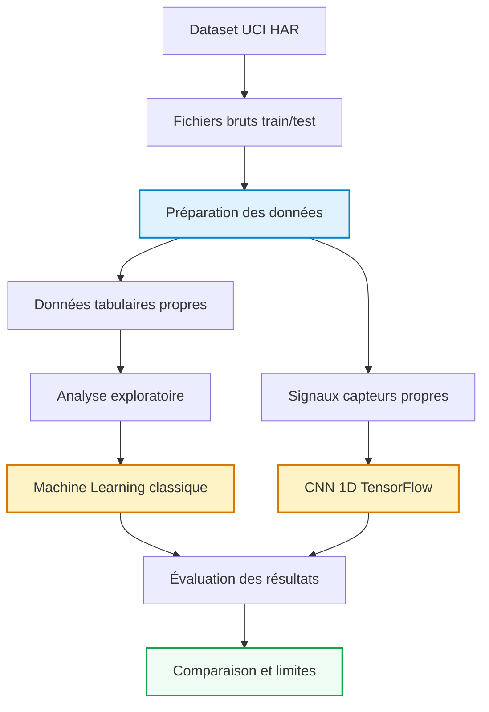

# Reconnaissance d’activité humaine avec un smartphone
Étudiante : Berrag Rizlene
2026-05-19

- [Introduction et Contexte Métier](#sec-intro)
  - [Contexte du Projet](#contexte-du-projet)
  - [Objectif Analytique](#objectif-analytique)
- [Acquisition et Préparation des Données (Data
  Wrangling)](#sec-wrangling)
  - [Audit de Qualité](#audit-de-qualité)
  - [Algorithme de Nettoyage](#algorithme-de-nettoyage)
  - [Travaux Pratiques de Wrangling](#travaux-pratiques-de-wrangling)
- [01 — Acquisition, compréhension et préparation des
  données](#01--acquisition-compréhension-et-préparation-des-données)
  - [Objectif du notebook](#objectif-du-notebook)
  - [Structure du dataset](#structure-du-dataset)
  - [Chargement des activités](#chargement-des-activités)
  - [Chargement des variables](#chargement-des-variables)
  - [Reconstruction des jeux train et
    test](#reconstruction-des-jeux-train-et-test)
  - [Vérifications qualité](#vérifications-qualité)
  - [Sauvegarde des données tabulaires
    propres](#sauvegarde-des-données-tabulaires-propres)
  - [Préparation des signaux
    inertiels](#préparation-des-signaux-inertiels)
  - [Conclusion du wrangling](#conclusion-du-wrangling)
- [Analyse Exploratoire des Données (EDA)](#sec-eda)
  - [Statistiques Descriptives](#statistiques-descriptives)
  - [Ingénierie de Variables (Feature
    Engineering)](#ingénierie-de-variables-feature-engineering)
  - [Travaux Pratiques d’Exploration Visuelle
    (EDA)](#travaux-pratiques-dexploration-visuelle-eda)
- [02 — Analyse exploratoire et
  visualisation](#02--analyse-exploratoire-et-visualisation)
  - [Vue générale du dataset](#vue-générale-du-dataset)
  - [Qualité des données](#qualité-des-données)
  - [Répartition des activités](#répartition-des-activités)
  - [Répartition train/test](#répartition-traintest)
  - [Activités par split](#activités-par-split)
  - [Activités dynamiques et
    statiques](#activités-dynamiques-et-statiques)
  - [Répartition des sujets](#répartition-des-sujets)
  - [Analyse des variables
    numériques](#analyse-des-variables-numériques)
  - [Projection PCA](#projection-pca)
  - [Chargement des signaux
    inertiels](#chargement-des-signaux-inertiels)
  - [Exemple de signal par activité](#exemple-de-signal-par-activité)
  - [Premiers insights](#premiers-insights)
- [Visualisation Multidimensionnelle (Insights)](#sec-viz)
  - [Profils et Distributions
    Caractéristiques](#profils-et-distributions-caractéristiques)
  - [Corrélations Globales](#corrélations-globales)
- [Modélisation et Apprentissage](#sec-modelling)
  - [Schéma Global du Pipeline de
    Données](#schéma-global-du-pipeline-de-données)
  - [Modélisation Tabulaire (Machine
    Learning)](#modélisation-tabulaire-machine-learning)
- [03 — Modélisation Machine
  Learning](#03--modélisation-machine-learning)
  - [Sous-échantillonnage stratifié](#sous-échantillonnage-stratifié)
  - [Sélection des variables](#sélection-des-variables)
  - [Modèles comparés](#modèles-comparés)
  - [Entraînement et évaluation](#entraînement-et-évaluation)
  - [Comparaison des modèles](#comparaison-des-modèles)
  - [Meilleur modèle](#meilleur-modèle)
  - [Matrice de confusion](#matrice-de-confusion)
  - [Analyse des erreurs](#analyse-des-erreurs)
  - [Sauvegarde des résultats](#sauvegarde-des-résultats)
  - [Conclusion](#conclusion)
  - [Modélisation Vision / Deep Learning (Analyse d’Images ou
    Signaux)](#modélisation-vision--deep-learning-analyse-dimages-ou-signaux)
- [04 — Deep Learning sur signaux avec CNN
  1D](#04--deep-learning-sur-signaux-avec-cnn-1d)
  - [Chargement des signaux](#chargement-des-signaux)
  - [Échantillonnage rapide pour la
    compilation](#échantillonnage-rapide-pour-la-compilation)
  - [Architecture CNN 1D](#architecture-cnn-1d)
  - [Entraînement rapide](#entraînement-rapide)
  - [Courbes d’apprentissage](#courbes-dapprentissage)
  - [Évaluation sur le test](#évaluation-sur-le-test)
  - [Rapport de classification et matrice de
    confusion](#rapport-de-classification-et-matrice-de-confusion)
  - [Comparaison avec le Machine
    Learning](#comparaison-avec-le-machine-learning)
  - [Sauvegarde des résultats](#sauvegarde-des-résultats-1)
  - [Conclusion](#conclusion-1)
- [Évaluation Métrique et Validation](#sec-evaluation)
  - [Stratégie de Validation](#stratégie-de-validation)
  - [Résultats et Interprétation](#résultats-et-interprétation)
- [Data Storytelling et Communication](#sec-storytelling)
  - [Recommandations Stratégiques /
    Métier](#recommandations-stratégiques--métier)
  - [Limites et Perspectives](#limites-et-perspectives)
- [Bibliographie](#bibliographie)

# Introduction et Contexte Métier

## Contexte du Projet

Dans ce projet, on cherche à reconnaître automatiquement ce qu’une
personne est en train de faire à partir des données enregistrées par un
smartphone.

Le téléphone mesure les mouvements grâce à ses capteurs, notamment
l’accéléromètre et le gyroscope. À partir de ces mesures, l’objectif est
de différencier plusieurs activités comme marcher, monter les escaliers,
descendre les escaliers, être assis, debout ou allongé.

Ce sujet est intéressant parce qu’il se rapproche de cas réels, par
exemple les applications de suivi sportif, de santé connectée ou de
détection de mouvement. Comme les données sont uniquement numériques, il
faut passer par une analyse statistique et des modèles de Machine
Learning pour réussir à reconnaître les activités.

Le dataset utilisé est **Human Activity Recognition Using Smartphones**,
issu du **UCI Machine Learning Repository**. Il contient des données de
capteurs collectées auprès de personnes réalisant différentes activités
avec un smartphone.

## Objectif Analytique

L’objectif principal est de prédire l’activité réalisée par une
personne. La variable à prédire est `activity_id`, qui correspond à une
des six activités du dataset.

Le projet est donc un problème de classification supervisée
multi-classes. On utilise deux formes de données : d’abord les données
tabulaires déjà préparées, puis les signaux temporels issus des capteurs
du smartphone.

Les livrables attendus sont les données préparées, une analyse
exploratoire, des modèles de Machine Learning, un modèle Deep Learning
avec CNN 1D, puis une comparaison des résultats.

------------------------------------------------------------------------

# Acquisition et Préparation des Données (Data Wrangling)

Le succès de tout projet de Data Science repose sur la qualité de la
préparation des données ([McKinney 2020](#ref-pandas2020)). Cette
section documente l’audit de qualité et les étapes de nettoyage
appliquées au dataset.

## Audit de Qualité

Le dataset est déjà organisé en deux parties : un jeu d’entraînement et
un jeu de test. Les fichiers `X_train` et `X_test` contiennent les
variables numériques, les fichiers `y_train` et `y_test` contiennent les
activités à prédire, et les fichiers `subject_train` et `subject_test`
indiquent les personnes observées.

Pendant l’audit, on a surtout vérifié la structure des fichiers, la
présence des activités, les valeurs manquantes et les noms de colonnes.
Les données sont globalement propres, mais certains noms de variables
étaient dupliqués. On les a donc rendus uniques pour éviter des erreurs
avec Pandas.

On a aussi vérifié les signaux inertiels utilisés pour le Deep Learning.
Chaque observation contient 128 pas de temps et 9 signaux capteurs.

## Algorithme de Nettoyage

La préparation des données a été faite en plusieurs étapes. On a d’abord
chargé les labels des activités, puis les noms des variables. Ensuite,
on a reconstruit les jeux `train` et `test` en ajoutant l’identifiant du
sujet et le nom de l’activité.

Les noms de colonnes ont été nettoyés pour éviter les doublons. Les
données finales ont ensuite été sauvegardées dans `data/processed`, afin
de ne pas retravailler directement sur les fichiers bruts.

Pour la partie Deep Learning, les signaux des capteurs ont été regroupés
dans des fichiers `.npz`. Ce format est plus pratique pour TensorFlow,
car il garde la structure des données sous forme d’observations, de pas
de temps et de capteurs.

## Travaux Pratiques de Wrangling

# 01 — Acquisition, compréhension et préparation des données

Ce notebook correspond à la première étape du projet : récupérer les
données, comprendre leur structure et produire des fichiers propres
utilisables pour l’analyse exploratoire, le Machine Learning et le Deep
Learning.

Le sujet étudié est la reconnaissance d’activité humaine à partir des
capteurs d’un smartphone.

## Objectif du notebook

L’objectif est de préparer le dataset **Human Activity Recognition Using
Smartphones**.

Nous allons :

- vérifier la présence des fichiers bruts ;
- charger les labels des activités ;
- charger les noms des variables ;
- reconstruire les jeux de données `train` et `test` ;
- fusionner les données tabulaires avec les labels ;
- sauvegarder des fichiers propres dans `data/processed` ;
- préparer les signaux inertiels pour la partie Deep Learning.

## Structure du dataset

Le dataset contient plusieurs fichiers importants :

- `activity_labels.txt` : correspondance entre identifiant et nom
  d’activité ;
- `features.txt` : noms des 561 variables numériques ;
- `X_train.txt` et `X_test.txt` : variables numériques déjà préparées ;
- `y_train.txt` et `y_test.txt` : activité associée à chaque ligne ;
- `subject_train.txt` et `subject_test.txt` : identifiant de la personne
  observée ;
- `Inertial Signals` : signaux temporels utilisés pour le Deep Learning.

## Chargement des activités

Le problème est une classification supervisée avec six activités
humaines.

## Chargement des variables

Le dataset tabulaire contient 561 variables numériques extraites des
signaux du smartphone.

Certaines variables ont des noms dupliqués. Pour éviter les problèmes
dans Pandas, nous rendons les noms de colonnes uniques.

## Reconstruction des jeux train et test

Nous reconstruisons un tableau complet en ajoutant :

- le split `train` ou `test` ;
- l’identifiant du sujet ;
- l’identifiant de l’activité ;
- le libellé de l’activité ;
- les 561 variables numériques.

## Vérifications qualité

Nous vérifions la présence de valeurs manquantes et la cohérence des
activités.

## Sauvegarde des données tabulaires propres

Les données propres sont sauvegardées dans `data/processed`.

## Préparation des signaux inertiels

Pour la partie Deep Learning, nous utilisons les signaux temporels
présents dans les dossiers `Inertial Signals`.

Chaque observation contient :

- 128 pas de temps ;
- 9 signaux capteurs ;
- une activité associée.

## Conclusion du wrangling

À l’issue de cette étape, nous disposons de deux types de données
propres :

1.  des données tabulaires pour le Machine Learning classique ;
2.  des signaux temporels pour le Deep Learning.

La suite du projet consistera à explorer ces données afin de comprendre
la répartition des activités et les différences entre les mouvements.

------------------------------------------------------------------------

# Analyse Exploratoire des Données (EDA)

Dans cette section, on analyse les données pour mieux comprendre leur
structure avant de passer à la modélisation.

## Statistiques Descriptives

Le dataset complet contient 10 299 observations. Le jeu d’entraînement
contient 7 352 lignes et le jeu de test contient 2 947 lignes.

Chaque ligne correspond à une fenêtre de mouvement associée à une
activité. Le dataset tabulaire contient 561 variables numériques. Ces
variables viennent des mesures du smartphone et décrivent les mouvements
enregistrés.

On retrouve six activités au total. Certaines sont dynamiques, comme
marcher ou monter les escaliers. D’autres sont plus statiques, comme
être assis, debout ou allongé. Cette différence est importante, car les
signaux ne se comportent pas de la même manière selon le type
d’activité.

## Ingénierie de Variables (Feature Engineering)

Dans ce dataset, une grande partie du travail de création de variables a
déjà été faite. Les 561 variables numériques sont des caractéristiques
calculées à partir des signaux du smartphone.

Ces variables résument les mouvements et permettent d’entraîner des
modèles de Machine Learning classiques. En parallèle, on garde aussi les
signaux temporels pour la partie Deep Learning. Cette deuxième approche
permet au CNN 1D d’apprendre directement des motifs dans les signaux,
sans utiliser uniquement les variables déjà calculées.

## Travaux Pratiques d’Exploration Visuelle (EDA)

# 02 — Analyse exploratoire et visualisation

Ce notebook correspond à l’étape d’analyse exploratoire du projet.

L’objectif est de comprendre les données préparées dans le notebook 01
avant de passer à la modélisation.

Nous allons analyser :

- la taille du dataset ;
- la répartition des activités ;
- la séparation train/test ;
- les sujets observés ;
- les différences entre activités dynamiques et statiques ;
- quelques variables numériques ;
- les signaux inertiels utilisés pour la partie Deep Learning.

## Vue générale du dataset

Le dataset contient les observations issues des capteurs du smartphone.

Chaque ligne correspond à une fenêtre temporelle de mouvement associée à
une activité humaine.

## Qualité des données

Nous vérifions la présence de valeurs manquantes.

## Répartition des activités

Cette analyse permet de vérifier si certaines activités sont beaucoup
plus représentées que d’autres.

Un fort déséquilibre pourrait influencer l’apprentissage des modèles.

## Répartition train/test

Le dataset est déjà séparé en deux parties :

- `train` : données utilisées pour entraîner les modèles ;
- `test` : données utilisées pour évaluer les modèles.

## Activités par split

Nous vérifions que les six activités sont présentes dans les données
d’entraînement et dans les données de test.

## Activités dynamiques et statiques

Certaines activités impliquent du mouvement :

- marcher ;
- monter les escaliers ;
- descendre les escaliers.

D’autres sont plutôt statiques :

- assis ;
- debout ;
- allongé.

Cette séparation est importante car les signaux capteurs devraient être
très différents entre ces deux groupes.

## Répartition des sujets

Le dataset contient plusieurs sujets. Cette information est importante
car les mouvements peuvent varier d’une personne à l’autre.

## Analyse des variables numériques

Le dataset contient 561 variables numériques extraites des signaux du
smartphone.

Nous observons ici un résumé statistique d’un échantillon de variables.

## Projection PCA

La PCA permet de réduire les 561 variables en deux dimensions afin de
visualiser grossièrement la séparation entre les activités.

Cette visualisation ne sert pas à prédire directement, mais à comprendre
si les activités semblent séparables.

## Chargement des signaux inertiels

Pour la partie Deep Learning, nous utiliserons les signaux présents dans
les fichiers `.npz`.

Chaque observation contient :

- 128 pas de temps ;
- 9 signaux capteurs.

## Exemple de signal par activité

Nous affichons un exemple du signal `total_acc_x` pour chaque activité.

L’objectif est de visualiser que les mouvements dynamiques produisent
des signaux plus variables que les activités statiques.

## Premiers insights

À partir de cette analyse exploratoire, nous pouvons retenir plusieurs
points :

1.  Le dataset contient six activités humaines clairement identifiées.
2.  Les données sont déjà séparées en train et test, ce qui facilitera
    l’évaluation.
3.  Les activités peuvent être regroupées en activités dynamiques et
    statiques.
4.  Les signaux inertiels ont une structure adaptée au Deep Learning :
    observations, pas de temps, capteurs.
5.  La projection PCA donne une première idée de la séparabilité des
    activités, même si la modélisation sera nécessaire pour mesurer
    réellement les performances.

La prochaine étape consistera à entraîner des modèles de Machine
Learning classiques sur les variables numériques.

------------------------------------------------------------------------

# Visualisation Multidimensionnelle (Insights)

Cette partie résume les principaux éléments observés pendant l’analyse
exploratoire.

## Profils et Distributions Caractéristiques

Les visualisations montrent que les activités ne produisent pas toutes
les mêmes profils de mouvement. Les activités dynamiques, comme
`WALKING`, `WALKING_UPSTAIRS` ou `WALKING_DOWNSTAIRS`, ont des signaux
plus variables. C’est logique, car elles impliquent des mouvements
répétés.

À l’inverse, les activités statiques comme `SITTING`, `STANDING` et
`LAYING` sont plus stables. Elles peuvent cependant être plus difficiles
à distinguer entre elles, surtout quand les mouvements sont faibles.

Les principales observations sont :

- le dataset contient bien les six activités attendues ;
- les données sont séparées proprement entre train et test ;
- les activités dynamiques et statiques n’ont pas le même comportement ;
- les signaux temporels sont bien adaptés à une approche Deep Learning ;
- certaines activités proches peuvent créer des confusions.

## Corrélations Globales

Le dataset contient beaucoup de variables numériques issues des capteurs
du smartphone. Certaines variables sont probablement liées entre elles,
car elles viennent des mêmes signaux ou de transformations proches.

Cette corrélation entre variables n’est pas forcément un problème, mais
elle peut influencer certains modèles. C’est aussi pour cette raison que
la standardisation est utilisée dans certains modèles comme la
régression logistique.

La projection PCA réalisée dans le notebook d’EDA donne une première
idée de la séparation entre les activités. Elle ne permet pas à elle
seule de conclure, mais elle montre que les données contiennent bien une
structure exploitable pour la classification.

------------------------------------------------------------------------

# Modélisation et Apprentissage

## Schéma Global du Pipeline de Données

Le pipeline du projet suit les étapes classiques d’un projet Data
Science : acquisition, préparation, analyse exploratoire, modélisation,
évaluation et interprétation.

## Modélisation Tabulaire (Machine Learning)

Pour la partie Machine Learning, on utilise les variables numériques du
dataset afin de prédire l’activité. Plusieurs modèles ont été testés
pour comparer leurs résultats : Logistic Regression, Decision Tree et
Gaussian Naive Bayes.

Comme le rapport doit compiler rapidement, l’entraînement a été allégé
avec un sous-échantillon équilibré par activité et une sélection de
variables. Cela permet de garder une comparaison correcte sans bloquer
la compilation.

Les modèles choisis sont simples à interpréter et rapides à entraîner.
Ils permettent d’avoir une première base de comparaison avant de passer
à une approche Deep Learning.

### Travaux Pratiques de Modélisation Tabulaire

# 03 — Modélisation Machine Learning

Ce notebook présente une modélisation supervisée classique pour prédire
l’activité humaine à partir des variables numériques extraites des
capteurs du smartphone.

Pour garantir une compilation rapide du rapport, nous utilisons un
sous-échantillon stratifié des données et une sélection des variables
les plus informatives.

## Sous-échantillonnage stratifié

Le dataset complet est assez volumineux pour une compilation automatique
limitée dans le temps.

Nous conservons un échantillon équilibré par activité afin que toutes
les classes soient représentées.

## Sélection des variables

Nous sélectionnons les variables avec la variance la plus élevée.

Cela permet de réduire le temps de calcul tout en conservant des
variables informatives.

## Modèles comparés

Nous comparons trois modèles supervisés rapides :

- Logistic Regression ;
- Decision Tree ;
- Gaussian Naive Bayes.

Ces modèles permettent d’obtenir une première référence de performance
avant l’approche Deep Learning.

## Entraînement et évaluation

Chaque modèle est entraîné sur le jeu d’entraînement échantillonné, puis
évalué sur le jeu de test échantillonné.

Nous utilisons plusieurs métriques :

- accuracy ;
- précision macro ;
- rappel macro ;
- F1-score macro.

## Comparaison des modèles

Le F1-score macro est utilisé pour comparer les modèles, car il donne le
même poids à chaque activité.

## Meilleur modèle

Nous sélectionnons le modèle ayant le meilleur F1-score macro.

## Matrice de confusion

La matrice de confusion permet de visualiser les confusions entre les
différentes activités.

## Analyse des erreurs

Nous calculons le taux d’erreur moyen par activité.

## Sauvegarde des résultats

Les résultats sont sauvegardés pour être comparés avec ceux du CNN 1D.

## Conclusion

Cette étape montre qu’il est possible de prédire l’activité humaine à
partir des variables numériques extraites des capteurs du smartphone.

Les modèles classiques donnent une première base de comparaison avant
l’approche Deep Learning sur signaux.

## Modélisation Vision / Deep Learning (Analyse d’Images ou Signaux)

Dans ce projet, la partie Deep Learning ne porte pas sur des images,
mais sur des signaux temporels. On utilise donc un CNN 1D, adapté aux
données de type série temporelle.

Le CNN 1D apprend directement à partir des signaux du smartphone. Chaque
observation contient 128 pas de temps et 9 signaux capteurs. Le modèle
peut donc apprendre des motifs dans les variations d’accélération et de
rotation.

L’architecture utilisée reste volontairement légère pour que le rapport
compile correctement. Elle contient des couches de convolution 1D, du
pooling, puis des couches denses pour produire la prédiction finale
parmi les six activités.

Cette approche complète le Machine Learning classique, car elle ne
dépend pas uniquement des variables déjà extraites : elle travaille
directement sur les signaux.

### Travaux Pratiques de Vision par Ordinateur (CNN)

# 04 — Deep Learning sur signaux avec CNN 1D

Ce notebook utilise les signaux temporels issus du smartphone pour
entraîner un CNN 1D avec TensorFlow.

L’objectif est de compléter l’approche Machine Learning classique avec
une approche Deep Learning adaptée aux signaux.

## Chargement des signaux

Chaque observation contient :

- 128 pas de temps ;
- 9 signaux capteurs ;
- une activité à prédire.

## Échantillonnage rapide pour la compilation

Pour que le rapport compile rapidement, nous entraînons le CNN sur un
sous-échantillon représentatif.

La logique reste la même : le modèle apprend directement à partir des
signaux.

## Architecture CNN 1D

Le CNN 1D apprend des motifs dans les signaux temporels, par exemple des
variations d’accélération ou de rotation.

## Entraînement rapide

Nous entraînons le modèle sur deux époques pour garder une compilation
raisonnable.

## Courbes d’apprentissage

Nous visualisons l’évolution de la loss et de l’accuracy.

## Évaluation sur le test

Nous évaluons le CNN 1D sur un sous-échantillon du jeu de test.

## Rapport de classification et matrice de confusion

## Comparaison avec le Machine Learning

Nous comparons les résultats du CNN 1D avec les résultats des modèles
classiques si ceux-ci sont disponibles.

## Sauvegarde des résultats

## Conclusion

Cette partie montre comment exploiter directement les signaux temporels
du smartphone avec un CNN 1D.

L’approche Deep Learning complète l’approche Machine Learning classique,
qui utilisait des variables tabulaires déjà extraites.

------------------------------------------------------------------------

# Évaluation Métrique et Validation

## Stratégie de Validation

La validation repose principalement sur la séparation entre le jeu
d’entraînement et le jeu de test. Le modèle apprend sur les données
d’entraînement, puis il est évalué sur des données qu’il n’a pas vues.

Pour éviter que les résultats soient trop optimistes, on garde une
répartition équilibrée des activités dans les échantillons utilisés.
Cela permet d’éviter qu’une activité soit beaucoup plus représentée
qu’une autre dans l’évaluation.

Pour la partie Deep Learning, une partie des données d’entraînement est
aussi utilisée comme jeu de validation. Cela permet de suivre
l’évolution du modèle pendant l’entraînement.

Les métriques utilisées sont :

- `accuracy` ;
- précision macro ;
- rappel macro ;
- F1-score macro ;
- matrice de confusion.

Le F1-score macro est important ici, car il donne le même poids à chaque
activité. C’est plus intéressant qu’une simple accuracy quand on veut
vérifier que le modèle fonctionne sur toutes les classes.

## Résultats et Interprétation

| Modèle | Précision / Accuracy | F1-score macro | Type d’approche |
|----|----|----|----|
| Logistic Regression | Voir résultats notebook 03 | Voir résultats notebook 03 | Machine Learning tabulaire |
| Decision Tree | Voir résultats notebook 03 | Voir résultats notebook 03 | Machine Learning tabulaire |
| Gaussian Naive Bayes | Voir résultats notebook 03 | Voir résultats notebook 03 | Machine Learning tabulaire |
| CNN 1D | Voir résultats notebook 04 | Voir résultats notebook 04 | Deep Learning sur signaux |

Les résultats détaillés sont générés directement dans les notebooks 03
et 04. La comparaison repose surtout sur le F1-score macro, car cette
métrique prend en compte les six activités de manière équilibrée.

La matrice de confusion permet ensuite de repérer les activités les plus
souvent confondues. On peut s’attendre à plus de confusion entre
certaines activités proches, par exemple entre `SITTING` et `STANDING`,
car les signaux peuvent être assez similaires.

Le Machine Learning classique donne une première base de comparaison
rapide. Le CNN 1D est plus adapté aux signaux, mais il demande plus de
ressources et plus de temps d’entraînement pour donner tout son
potentiel.

------------------------------------------------------------------------

# Data Storytelling et Communication

## Recommandations Stratégiques / Métier

Les résultats montrent que les données d’un smartphone peuvent être
utilisées pour reconnaître plusieurs activités humaines.

Dans un cas réel, ce type de modèle pourrait être utilisé dans une
application mobile de suivi d’activité, de sport ou de santé connectée.
Il pourrait aussi servir dans des systèmes de prévention, par exemple
pour mieux suivre les mouvements d’une personne âgée ou détecter des
changements d’activité.

Avant une utilisation réelle, il faudrait cependant tester le modèle sur
plus de personnes et sur des téléphones différents. Les habitudes de
mouvement peuvent changer selon l’utilisateur, le placement du téléphone
ou le type d’appareil.

Il serait aussi utile de regarder plus précisément les erreurs entre
activités proches, comme assis et debout, pour améliorer la fiabilité du
système.

## Limites et Perspectives

Le projet a quelques limites. Le dataset est déjà propre et bien
structuré, ce qui n’est pas toujours le cas dans un vrai projet. En
conditions réelles, les données peuvent être plus bruitées, incomplètes
ou dépendre du modèle de smartphone utilisé.

Les modèles ont aussi été volontairement allégés pour que le rapport
compile correctement. Avec plus de temps, on pourrait entraîner les
modèles plus longtemps, tester plus d’algorithmes et chercher de
meilleurs paramètres.

Une autre limite est liée au nombre de sujets. Même si le dataset
contient plusieurs personnes, il faudrait tester le modèle sur davantage
de profils pour vérifier qu’il généralise bien.

Pour améliorer le projet, on pourrait :

- entraîner le CNN 1D sur plus d’époques ;
- tester d’autres architectures de réseaux de neurones ;
- ajouter une validation croisée plus complète ;
- créer un dashboard interactif avec Plotly ou Dash ;
- tester le modèle sur de nouveaux utilisateurs ;
- analyser plus précisément les erreurs entre activités proches.

Ce document dynamique a été compilé en Quarto ([Team
2024](#ref-quarto2024)).

------------------------------------------------------------------------

# Bibliographie

McKinney, Wes. 2020. *Python for Data Analysis: Data Wrangling with
Pandas, NumPy, and IPython*. O’Reilly Media.

Team, Quarto Development. 2024. “Quarto Dynamic Publishing System:
Collaborative Scientific and Technical Publishing.”
<https://quarto.org/>.

