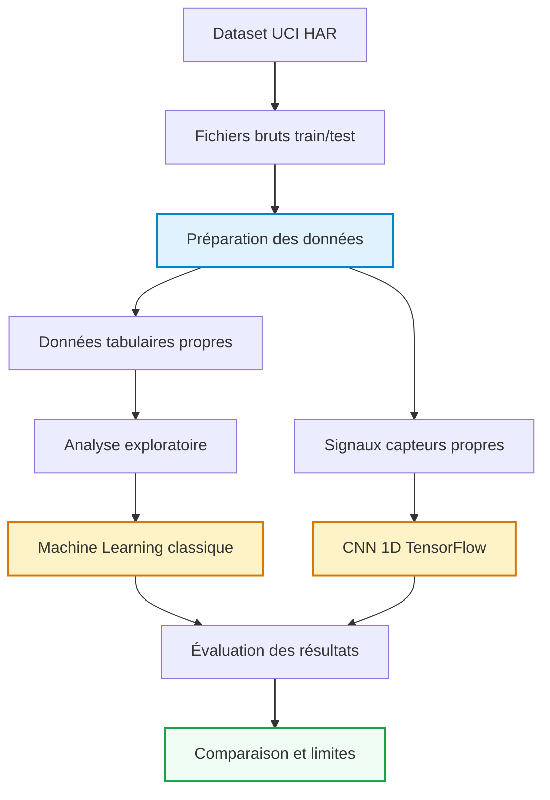

# Introduction et Contexte Métier {#sec-intro}

## Contexte du Projet

Dans ce projet, on cherche à reconnaître automatiquement ce qu’une personne est en train de faire à partir des données enregistrées par un smartphone.

Le téléphone mesure les mouvements grâce à ses capteurs, notamment l’accéléromètre et le gyroscope. À partir de ces mesures, l’objectif est de différencier plusieurs activités comme marcher, monter les escaliers, descendre les escaliers, être assis, debout ou allongé.

Ce sujet est intéressant parce qu’il se rapproche de cas réels, par exemple les applications de suivi sportif, de santé connectée ou de détection de mouvement. Comme les données sont uniquement numériques, il faut passer par une analyse statistique et des modèles de Machine Learning pour réussir à reconnaître les activités.

Le dataset utilisé est **Human Activity Recognition Using Smartphones**, issu du **UCI Machine Learning Repository**. Il contient des données de capteurs collectées auprès de personnes réalisant différentes activités avec un smartphone.

## Objectif Analytique

L’objectif principal est de prédire l’activité réalisée par une personne. La variable à prédire est `activity_id`, qui correspond à une des six activités du dataset.

Le projet est donc un problème de classification supervisée multi-classes. On utilise deux formes de données : d’abord les données tabulaires déjà préparées, puis les signaux temporels issus des capteurs du smartphone.

Les livrables attendus sont les données préparées, une analyse exploratoire, des modèles de Machine Learning, un modèle Deep Learning avec CNN 1D, puis une comparaison des résultats.

---

# Acquisition et Préparation des Données (Data Wrangling) {#sec-wrangling}

Le succès de tout projet de Data Science repose sur la qualité de la préparation des données [@pandas2020]. Cette section documente l’audit de qualité et les étapes de nettoyage appliquées au dataset.

## Audit de Qualité

Le dataset est déjà organisé en deux parties : un jeu d’entraînement et un jeu de test. Les fichiers `X_train` et `X_test` contiennent les variables numériques, les fichiers `y_train` et `y_test` contiennent les activités à prédire, et les fichiers `subject_train` et `subject_test` indiquent les personnes observées.

Pendant l’audit, on a surtout vérifié la structure des fichiers, la présence des activités, les valeurs manquantes et les noms de colonnes. Les données sont globalement propres, mais certains noms de variables étaient dupliqués. On les a donc rendus uniques pour éviter des erreurs avec Pandas.

On a aussi vérifié les signaux inertiels utilisés pour le Deep Learning. Chaque observation contient 128 pas de temps et 9 signaux capteurs.

## Algorithme de Nettoyage

La préparation des données a été faite en plusieurs étapes. On a d’abord chargé les labels des activités, puis les noms des variables. Ensuite, on a reconstruit les jeux `train` et `test` en ajoutant l’identifiant du sujet et le nom de l’activité.

Les noms de colonnes ont été nettoyés pour éviter les doublons. Les données finales ont ensuite été sauvegardées dans `data/processed`, afin de ne pas retravailler directement sur les fichiers bruts.

Pour la partie Deep Learning, les signaux des capteurs ont été regroupés dans des fichiers `.npz`. Ce format est plus pratique pour TensorFlow, car il garde la structure des données sous forme d’observations, de pas de temps et de capteurs.

## Travaux Pratiques de Wrangling



---

# Analyse Exploratoire des Données (EDA) {#sec-eda}

Dans cette section, on analyse les données pour mieux comprendre leur structure avant de passer à la modélisation.

## Statistiques Descriptives

Le dataset complet contient 10 299 observations. Le jeu d’entraînement contient 7 352 lignes et le jeu de test contient 2 947 lignes.

Chaque ligne correspond à une fenêtre de mouvement associée à une activité. Le dataset tabulaire contient 561 variables numériques. Ces variables viennent des mesures du smartphone et décrivent les mouvements enregistrés.

On retrouve six activités au total. Certaines sont dynamiques, comme marcher ou monter les escaliers. D’autres sont plus statiques, comme être assis, debout ou allongé. Cette différence est importante, car les signaux ne se comportent pas de la même manière selon le type d’activité.

## Ingénierie de Variables (Feature Engineering)

Dans ce dataset, une grande partie du travail de création de variables a déjà été faite. Les 561 variables numériques sont des caractéristiques calculées à partir des signaux du smartphone.

Ces variables résument les mouvements et permettent d’entraîner des modèles de Machine Learning classiques. En parallèle, on garde aussi les signaux temporels pour la partie Deep Learning. Cette deuxième approche permet au CNN 1D d’apprendre directement des motifs dans les signaux, sans utiliser uniquement les variables déjà calculées.

## Travaux Pratiques d’Exploration Visuelle (EDA)



---

# Visualisation Multidimensionnelle (Insights) {#sec-viz}

Cette partie résume les principaux éléments observés pendant l’analyse exploratoire.

## Profils et Distributions Caractéristiques

Les visualisations montrent que les activités ne produisent pas toutes les mêmes profils de mouvement. Les activités dynamiques, comme `WALKING`, `WALKING_UPSTAIRS` ou `WALKING_DOWNSTAIRS`, ont des signaux plus variables. C’est logique, car elles impliquent des mouvements répétés.

À l’inverse, les activités statiques comme `SITTING`, `STANDING` et `LAYING` sont plus stables. Elles peuvent cependant être plus difficiles à distinguer entre elles, surtout quand les mouvements sont faibles.

Les principales observations sont :

- le dataset contient bien les six activités attendues ;
- les données sont séparées proprement entre train et test ;
- les activités dynamiques et statiques n’ont pas le même comportement ;
- les signaux temporels sont bien adaptés à une approche Deep Learning ;
- certaines activités proches peuvent créer des confusions.

## Corrélations Globales

Le dataset contient beaucoup de variables numériques issues des capteurs du smartphone. Certaines variables sont probablement liées entre elles, car elles viennent des mêmes signaux ou de transformations proches.

Cette corrélation entre variables n’est pas forcément un problème, mais elle peut influencer certains modèles. C’est aussi pour cette raison que la standardisation est utilisée dans certains modèles comme la régression logistique.

La projection PCA réalisée dans le notebook d’EDA donne une première idée de la séparation entre les activités. Elle ne permet pas à elle seule de conclure, mais elle montre que les données contiennent bien une structure exploitable pour la classification.

---

# Modélisation et Apprentissage {#sec-modelling}

## Schéma Global du Pipeline de Données

Le pipeline du projet suit les étapes classiques d’un projet Data Science : acquisition, préparation, analyse exploratoire, modélisation, évaluation et interprétation.

## Modélisation Tabulaire (Machine Learning)

Pour la partie Machine Learning, on utilise les variables numériques du dataset afin de prédire l’activité. Plusieurs modèles ont été testés pour comparer leurs résultats : Logistic Regression, Decision Tree et Gaussian Naive Bayes.

Comme le rapport doit compiler rapidement, l’entraînement a été allégé avec un sous-échantillon équilibré par activité et une sélection de variables. Cela permet de garder une comparaison correcte sans bloquer la compilation.

Les modèles choisis sont simples à interpréter et rapides à entraîner. Ils permettent d’avoir une première base de comparaison avant de passer à une approche Deep Learning.

### Travaux Pratiques de Modélisation Tabulaire



## Modélisation Vision / Deep Learning (Analyse d’Images ou Signaux)

Dans ce projet, la partie Deep Learning ne porte pas sur des images, mais sur des signaux temporels. On utilise donc un CNN 1D, adapté aux données de type série temporelle.

Le CNN 1D apprend directement à partir des signaux du smartphone. Chaque observation contient 128 pas de temps et 9 signaux capteurs. Le modèle peut donc apprendre des motifs dans les variations d’accélération et de rotation.

L’architecture utilisée reste volontairement légère pour que le rapport compile correctement. Elle contient des couches de convolution 1D, du pooling, puis des couches denses pour produire la prédiction finale parmi les six activités.

Cette approche complète le Machine Learning classique, car elle ne dépend pas uniquement des variables déjà extraites : elle travaille directement sur les signaux.

### Travaux Pratiques de Vision par Ordinateur (CNN)



---

# Évaluation Métrique et Validation {#sec-evaluation}

## Stratégie de Validation

La validation repose principalement sur la séparation entre le jeu d’entraînement et le jeu de test. Le modèle apprend sur les données d’entraînement, puis il est évalué sur des données qu’il n’a pas vues.

Pour éviter que les résultats soient trop optimistes, on garde une répartition équilibrée des activités dans les échantillons utilisés. Cela permet d’éviter qu’une activité soit beaucoup plus représentée qu’une autre dans l’évaluation.

Pour la partie Deep Learning, une partie des données d’entraînement est aussi utilisée comme jeu de validation. Cela permet de suivre l’évolution du modèle pendant l’entraînement.

Les métriques utilisées sont :

- `accuracy` ;
- précision macro ;
- rappel macro ;
- F1-score macro ;
- matrice de confusion.

Le F1-score macro est important ici, car il donne le même poids à chaque activité. C’est plus intéressant qu’une simple accuracy quand on veut vérifier que le modèle fonctionne sur toutes les classes.

## Résultats et Interprétation

| Modèle | Précision / Accuracy | F1-score macro | Type d’approche |
|--------|----------------------|----------------|-----------------|
| Logistic Regression | Voir résultats notebook 03 | Voir résultats notebook 03 | Machine Learning tabulaire |
| Decision Tree | Voir résultats notebook 03 | Voir résultats notebook 03 | Machine Learning tabulaire |
| Gaussian Naive Bayes | Voir résultats notebook 03 | Voir résultats notebook 03 | Machine Learning tabulaire |
| CNN 1D | Voir résultats notebook 04 | Voir résultats notebook 04 | Deep Learning sur signaux |

Les résultats détaillés sont générés directement dans les notebooks 03 et 04. La comparaison repose surtout sur le F1-score macro, car cette métrique prend en compte les six activités de manière équilibrée.

La matrice de confusion permet ensuite de repérer les activités les plus souvent confondues. On peut s’attendre à plus de confusion entre certaines activités proches, par exemple entre `SITTING` et `STANDING`, car les signaux peuvent être assez similaires.

Le Machine Learning classique donne une première base de comparaison rapide. Le CNN 1D est plus adapté aux signaux, mais il demande plus de ressources et plus de temps d’entraînement pour donner tout son potentiel.

---

# Data Storytelling et Communication {#sec-storytelling}

## Recommandations Stratégiques / Métier

Les résultats montrent que les données d’un smartphone peuvent être utilisées pour reconnaître plusieurs activités humaines.

Dans un cas réel, ce type de modèle pourrait être utilisé dans une application mobile de suivi d’activité, de sport ou de santé connectée. Il pourrait aussi servir dans des systèmes de prévention, par exemple pour mieux suivre les mouvements d’une personne âgée ou détecter des changements d’activité.

Avant une utilisation réelle, il faudrait cependant tester le modèle sur plus de personnes et sur des téléphones différents. Les habitudes de mouvement peuvent changer selon l’utilisateur, le placement du téléphone ou le type d’appareil.

Il serait aussi utile de regarder plus précisément les erreurs entre activités proches, comme assis et debout, pour améliorer la fiabilité du système.

## Limites et Perspectives

Le projet a quelques limites. Le dataset est déjà propre et bien structuré, ce qui n’est pas toujours le cas dans un vrai projet. En conditions réelles, les données peuvent être plus bruitées, incomplètes ou dépendre du modèle de smartphone utilisé.

Les modèles ont aussi été volontairement allégés pour que le rapport compile correctement. Avec plus de temps, on pourrait entraîner les modèles plus longtemps, tester plus d’algorithmes et chercher de meilleurs paramètres.

Une autre limite est liée au nombre de sujets. Même si le dataset contient plusieurs personnes, il faudrait tester le modèle sur davantage de profils pour vérifier qu’il généralise bien.

Pour améliorer le projet, on pourrait :

- entraîner le CNN 1D sur plus d’époques ;
- tester d’autres architectures de réseaux de neurones ;
- ajouter une validation croisée plus complète ;
- créer un dashboard interactif avec Plotly ou Dash ;
- tester le modèle sur de nouveaux utilisateurs ;
- analyser plus précisément les erreurs entre activités proches.

Ce document dynamique a été compilé en Quarto [@quarto2024].

---

# Bibliographie {.unnumbered}

::: {#refs}
:::
